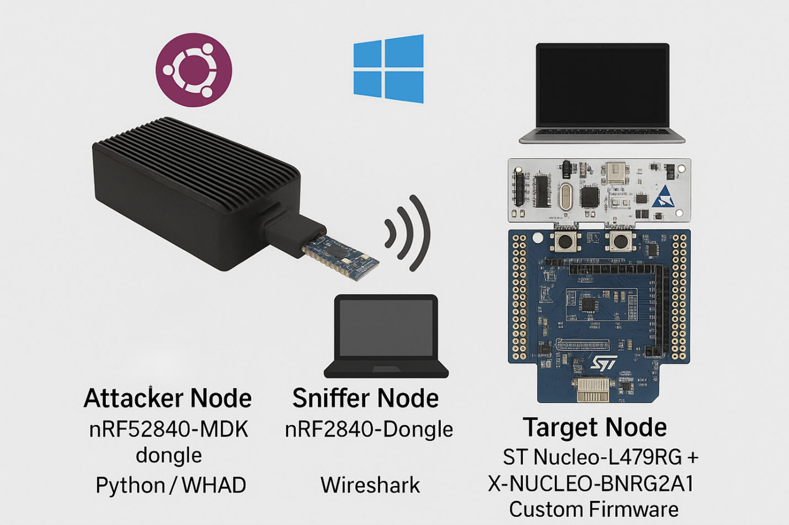
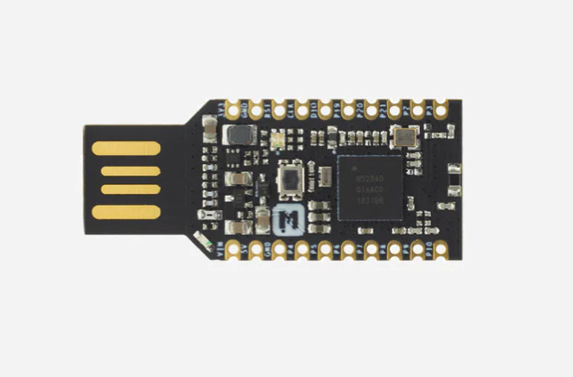
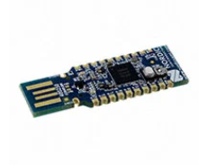
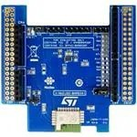

# BLE CGM-like Attack Lab — Reproducible Traffic Capture

## objective

Generate labeled Bluetooth Low Energy (BLE) attack traffic against a CGM-like peripheral, capture packets with a Nordic sniffer + Wireshark, and export PCAP/CSV for downstream ML experiments. The repository includes WHAD-based Python scripts for common attack patterns and a Windows sniffer workflow.

---

## bill of materials (bom)

**Hardware**
- Nordic nRF52840 Dongle (PCA10059) — Wireshark BLE sniffer.
- MakerDiary nRF52840-MDK USB Dongle — BLE attacker on Ubuntu.
- ST NUCLEO-L476RG — target MCU board.
- ST X-NUCLEO-BNRG2A1 (BlueNRG-M2SP) — BLE expansion card for the target.
- 2× quality USB cables (avoid marginal leads); optional powered USB hub.

**Software**
- Windows 11 + Wireshark 4.x + Nordic nRF Sniffer for BLE (extcap + firmware).
- Ubuntu 22.04/24.04 with Python 3.11 and `whad` (`pip install whad`).

> Ethics: perform experiments only on devices you own or are authorized to test.

---

## repository layout (expected)

ble-cgm-ble-attack-lab/
├── README.md
├── docs/
│ ├── lab_topology.md
│ ├── hardware_setup_windows_sniffer.md
│ ├── hardware_setup_ubuntu_attacker.md
│ ├── hardware_setup_st_target.md
│ └── img/
├── scripts/
│ ├── whad_utils.py
│ ├── gatt_dump.py
│ ├── write_flood.py
│ ├── long_write_abuse.py
│ ├── read_all_loop.py
│ ├── discovery_loop.py
│ ├── mtu_loop.py
│ ├── connect_churn.py
│ ├── subscribe_notify.py
│ └── subscribe_and_write.py
├── capture/
│ ├── wireshark_profile_notes.md
│ └── tshark_commands.md
└── analysis/
└── README.md


---

## lab topology (with photo placeholders)

Place photos in `docs/img/` with these exact names to render below:
- `lab_setup_overview.jpg` — bench wide shot (attacker/target/sniffer).
- `attacker_nrf52840_mdk.jpg` — MakerDiary MDK close-up.
- `sniffer_nrf52840_dongle.jpg` — Nordic PCA10059 close-up.
- `target_nucleo_l476rg_bnrg2a1.jpg` — NUCLEO + BNRG2A1 stack.

[Ubuntu laptop] --USB--> [nRF52840-MDK] (Attacker/Central)
[Windows 11 PC]--USB--> [nRF52840 Dongle] (Sniffer)
[STM32 NUCLEO-L476RG + X-NUCLEO-BNRG2A1] (Target/Peripheral)







---

## target peripheral — gatt profile (CGM-like)

Expose the following on the STM32 target (via STM32CubeMX + X-CUBE-BLE2/BLEMGR):
- Primary service: `d973f2e0-b19e-11e2-9e96-0800200c9a66`
- Notify characteristic (measurements): `d973f2e1-b19e-11e2-9e96-0800200c9a66`
- Write / Write-Without-Response characteristic (control): `d973f2e2-b19e-11e2-9e96-0800200c9a66`

**Validation from attacker (Ubuntu):**
```bash
export TARGET_MAC=AA:BB:CC:DD:EE:FF
python3 scripts/gatt_dump.py
# Expect to see the service above and its two characteristics


sniffer node — windows 11 + wireshark

Install Wireshark ≥ 4.0.

Install Nordic nRF Sniffer for BLE (extcap + firmware) and flash the nRF52840 Dongle when prompted.

Start Wireshark → select Nordic nRF Sniffer for Bluetooth LE interface.

Use the Sniffer toolbar to follow the target device (by address). If unknown, begin capture and select from device list.

Save captures under capture/ using a consistent convention:

capture/<YYYYMMDD>_<attack>_<runN>.pcapng

Convenience: For long sessions, use ring buffers (see capture/tshark_commands.md).

attacker node — ubuntu + whad

Install WHAD and set parameters:

python3 -m pip install --upgrade pip
pip install whad

export TARGET_MAC="AA:BB:CC:DD:EE:FF"
export CHAT_SERVICE_UUID="d973f2e0-b19e-11e2-9e96-0800200c9a66"
export NOTIFY_CHAR_UUID="d973f2e1-b19e-11e2-9e96-0800200c9a66"
export WRITE_CHAR_UUID="d973f2e2-b19e-11e2-9e96-0800200c9a66"

# 15-minute runs by default
export RUN_DURATION_S=900

Ensure your WHAD device interface is uart0 (the scripts use this logical name). The MakerDiary MDK typically enumerates as /dev/ttyACM* and is mapped by WHAD as uart0 automatically.

included attack scripts

Each script loops for RUN_DURATION_S seconds and auto-recovers on transient errors. Even if the target ignores payloads, the goal is to generate observable radio/GATT/L2CAP traffic for the sniffer to capture.

write_flood.py — high-rate Write Without Response (DoS-like APDU pressure).

long_write_abuse.py — large payload writes with response to stress ATT/L2CAP.

read_all_loop.py — discover then repeatedly read all readable characteristics.

discovery_loop.py — repeated service/characteristic discovery.

mtu_loop.py — repeated MTU exchange (REQ_MTU env var, default 247).

connect_churn.py — rapid connect/disconnect cycles.

subscribe_notify.py — enable notifications and remain subscribed.

subscribe_and_write.py — subscribe + concurrent writes (closest to CGM runtime).

Example (write flood, 15 min):

export RUN_DURATION_S=900
python3 scripts/write_flood.py

end-to-end experiment procedure

Layout & RF hygiene

Target centered, attacker/sniffer 0.5–1 m away.

Use short quality USB cables; avoid high-noise USB 3.0 ports if possible.

Target bring-up

Flash the Nucleo with CGM-like firmware (service/characteristics above).

Confirm advertising and GATT via phone scanner or gatt_dump.py.

Start sniffer capture (Windows)

Select Nordic nRF Sniffer for BLE interface and follow the target.

Verify LL_*, L2CAP_*, ATT_* frames appear.

Run attacks (Ubuntu)

Recommended 4×15-min sequence:

write_flood.py

read_all_loop.py

discovery_loop.py

connect_churn.py

Pause ~60 s between runs to reduce carryover effects.

Save PCAPs

Use the naming scheme: capture/<YYYYMMDD>_<attack>_<runN>.pcapng.

CSV export for ML

tshark -r capture/2025-11-14_write_flood_run1.pcapng \
  -T fields -E header=y -E separator=, \
  -e frame.time_epoch -e nordic_ble.channel -e btle.access_address \
  -e btatt.opcode -e btatt.handle -e frame.len -e btle.length \
  > capture/2025-11-14_write_flood_run1.csv

Quality checks

Wireshark: Statistics → Protocol Hierarchy and I/O Graphs.

Attack fingerprints:

write_flood: many ATT Handle Value Write (no response)

read_all_loop: repeated ATT Read/Read By Type

discovery_loop: bursts of Read By Group Type/Read By Type

connect_churn: frequent LL_CONNECTION_UPDATE / LL_TERMINATE_IND

automation (batch runs)
export RUN_DURATION_S=900
for s in write_flood.py read_all_loop.py discovery_loop.py connect_churn.py; do
  echo "[*] starting $s at $(date)"
  python3 "scripts/$s"
  echo "[*] finished $s at $(date)"
  sleep 60
done

troubleshooting

No frames in Wireshark

Confirm the Nordic nRF Sniffer for BLE interface is selected and the correct device is followed.

Attacker fails to connect

Swap USB cable; replug the MDK; ensure WHAD sees uart0. Reboot target if it reached connection limits.

Low notification rate

Make sure CCCD is enabled (script logs CCCD handle on success). Tune WRITE_SLEEP_S if needed.

Large PCAPs

Use ring buffers or break captures per attack run (see capture/tshark_commands.md).

license & attribution

This lab guide and scripts are intended for research and education. Use responsibly and within legal/organizational policy boundaries.

::contentReference[oaicite:0]{index=0}


